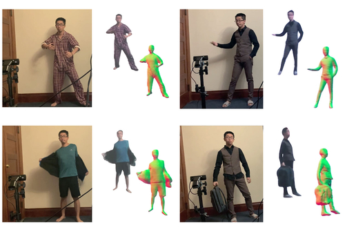
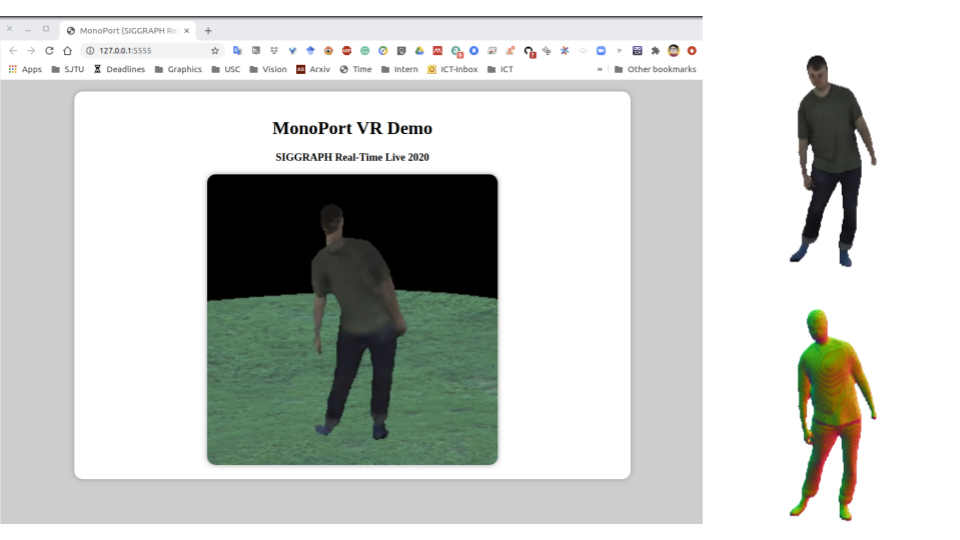

# [Monoport: Monocular Volumetric Human Teleportation (SIGGRAPH 2020 Real-Time Live)](http://xiuyuliang.cn/monoport/)

### Time: Tuesday, 25 August 2020 (Pacific Time Zone)
[](https://arxiv.org/abs/2007.13988) [](https://project-splinter.github.io/) [](https://youtu.be/fQDsYVE7GtQ)

<p align='center'>
    
</p>

Our volumetric capture system captures a completely clothed human body (including the back) using **a single RGB webcam** and in real time. 

## Requirements
- Python 3.7
- [PyTorch](https://pytorch.org/) tested on 1.4.0
- [ImplicitSegCUDA](https://github.com/Project-Splinter/ImplicitSegCUDA)
- [human_inst_seg](https://github.com/Project-Splinter/human_inst_seg)
- [streamer_pytorch](https://github.com/Project-Splinter/streamer_pytorch)
- [human_det](https://github.com/Project-Splinter/human_det)

**Note**: The last four dependencies are also developed by our team, and are all in active maintainess. If you meet any installation problems specificly regarding to those tools, we recommand you to file the issue in the corresponded repo. (You don't need to install them manally here as they are included in the requirements.txt)

## How to run our Siggraph RTL Demo

#### 1. Setup the repo
First you need to download the model:
```
sh scripts/download_model.sh
```

Then install all the dependencies:
```
pip install -r requirements.txt
```

#### 2. Start the main process as a server. 
```
# if you want to use the input from a webcam:
python RTL/main.py --use_server --ip <YOUR_IP_ADDRESS> --port 5555 --camera -- netG.ckpt_path ./data/PIFu/net_G netC.ckpt_path ./data/PIFu/net_C

# or if you want to use the input from a image folder:
python RTL/main.py --use_server --ip <YOUR_IP_ADDRESS> --port 5555 --image_folder <IMAGE_FOLDER> -- netG.ckpt_path ./data/PIFu/net_G netC.ckpt_path ./data/PIFu/net_C

# or if you want to use the input from a video:
python RTL/main.py --use_server --ip <YOUR_IP_ADDRESS> --port 5555 --videos <VIDEO_PATH> -- netG.ckpt_path ./data/PIFu/net_G netC.ckpt_path ./data/PIFu/net_C
```

If everything goes well, you should be able to see those logs after waiting for a few seconds:

    loading networkG from ./data/PIFu/net_G ...
    loading networkC from ./data/PIFu/net_C ...
    initialize data streamer ...
    Using cache found in /home/rui/.cache/torch/hub/NVIDIA_DeepLearningExamples_torchhub
    Using cache found in /home/rui/.cache/torch/hub/NVIDIA_DeepLearningExamples_torchhub
    * Serving Flask app "main" (lazy loading)
    * Environment: production
    WARNING: This is a development server. Do not use it in a production deployment.
    Use a production WSGI server instead.
    * Debug mode: on
    * Running on http://<YOUR_IP_ADDRESS>:5555/ (Press CTRL+C to quit)

#### 2. Access the server to start.
Open the page `http://<YOUR_IP_ADDRESS>:5555/` on a web browser from any device (Desktop/IPad/IPhone), You should be able to see the **MonoPort VR Demo** page on that device, and at the same time you should be able to see the a screen poping up on your desktop, showing the reconstructed normal and texture image.

<p align='center'>
    
</p>

## Contributors

MonoPort is based on [Monocular Real-Time Volumetric Performance Capture(ECCV'20)](https://project-splinter.github.io/), authored by Ruilong Li*([@liruilong940607](https://github.com/liruilong940607)), Yuliang Xiu*([@yuliangxiu](https://github.com/YuliangXiu)), Shunsuke Saito([@shunsukesaito](https://github.com/shunsukesaito)), Zeng Huang([@ImaginationZ](https://github.com/ImaginationZ)) and Kyle Olszewski([@kyleolsz](https://github.com/kyleolsz)), [Hao Li](https://www.hao-li.com/) is the corresponding author.


## Citation

```
@article{li2020monocular,
    title={Monocular Real-Time Volumetric Performance Capture},
    author={Li, Ruilong and Xiu, Yuliang and Saito, Shunsuke and Huang, Zeng and Olszewski, Kyle and Li, Hao},
    journal={arXiv preprint arXiv:2007.13988},
    year={2020}
  }
  
@inproceedings{10.1145/3407662.3407756,
    author = {Li, Ruilong and Olszewski, Kyle and Xiu, Yuliang and Saito, Shunsuke and Huang, Zeng and Li, Hao},
    title = {Volumetric Human Teleportation},
    year = {2020},
    isbn = {9781450380607},
    publisher = {Association for Computing Machinery},
    address = {New York, NY, USA},
    url = {https://doi.org/10.1145/3407662.3407756},
    doi = {10.1145/3407662.3407756},
    booktitle = {ACM SIGGRAPH 2020 Real-Time Live!},
    articleno = {9},
    numpages = {1},
    location = {Virtual Event, USA},
    series = {SIGGRAPH 2020}
  }
```

## Relevant Works

**[PIFu: Pixel-Aligned Implicit Function for High-Resolution Clothed Human Digitization (ICCV 2019)](https://shunsukesaito.github.io/PIFu/)**  
*Shunsuke Saito\*, Zeng Huang\*, Ryota Natsume\*, Shigeo Morishima, Angjoo Kanazawa, Hao Li*

The original work of Pixel-Aligned Implicit Function for geometry and texture reconstruction, unifying sigle-view and multi-view methods.

**[PIFuHD: Multi-Level Pixel-Aligned Implicit Function for High-Resolution 3D Human Digitization (CVPR 2020)](https://shunsukesaito.github.io/PIFuHD/)**  
*Shunsuke Saito, Tomas Simon, Jason Saragih, Hanbyul Joo*

They further improve the quality of reconstruction by leveraging multi-level approach!

**[ARCH: Animatable Reconstruction of Clothed Humans (CVPR 2020)](https://arxiv.org/pdf/2004.04572.pdf)**  
*Zeng Huang, Yuanlu Xu, Christoph Lassner, Hao Li, Tony Tung*

Learning PIFu in canonical space for animatable avatar generation!

**[Robust 3D Self-portraits in Seconds (CVPR 2020)](http://www.liuyebin.com/portrait/portrait.html)**  
*Zhe Li, Tao Yu, Chuanyu Pan, Zerong Zheng, Yebin Liu*

They extend PIFu to RGBD + introduce "PIFusion" utilizing PIFu reconstruction for non-rigid fusion.

## Relavant applications

**[Real-time VR PhD Defense](https://www.youtube.com/watch?v=RhWTqjVekVU&feature=youtu.be)**  
Dr. [Zeng Huang](https://zeng.science/) defensed his PhD virtually using our system. [(Media in Chinese)](https://mp.weixin.qq.com/s/Bl0HohrSVzaVPF0EHzuIWw)


----------
### For commercial queries, please contact:

Hao Li: hao@hao-li.com ccto: ruilongl@usc.edu
